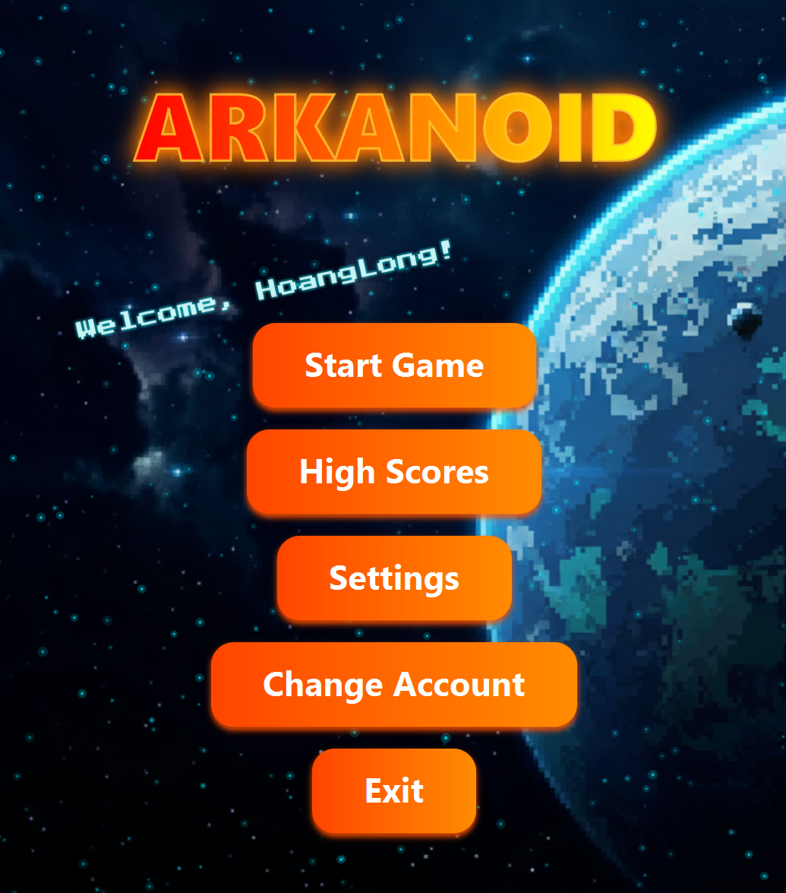
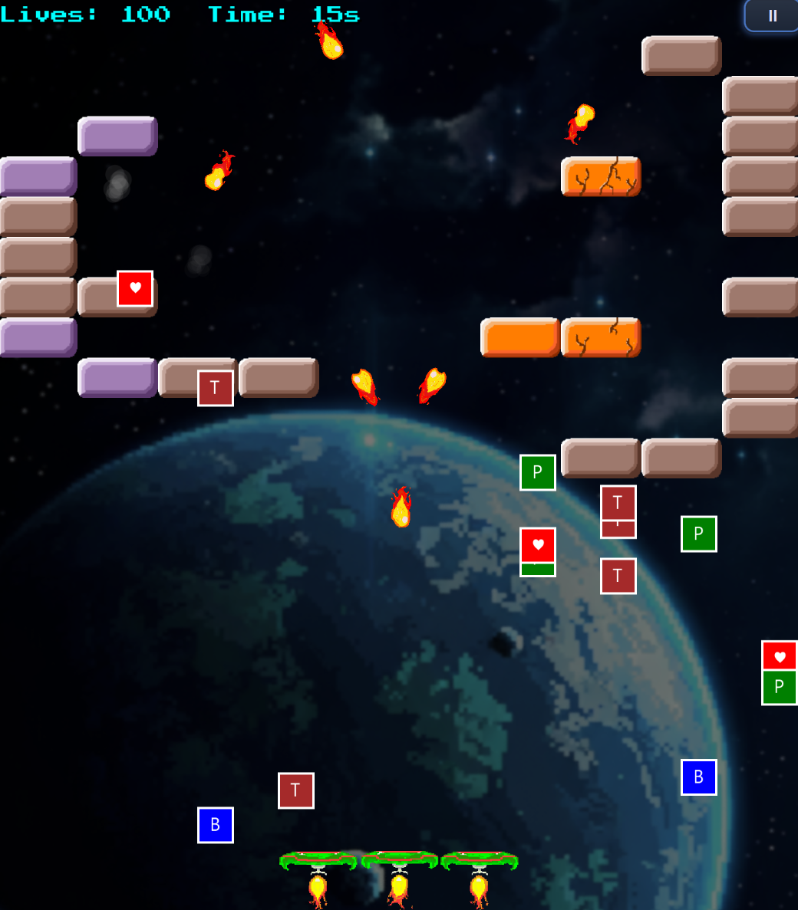
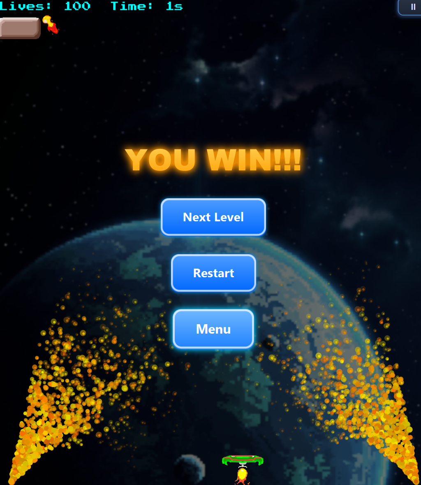
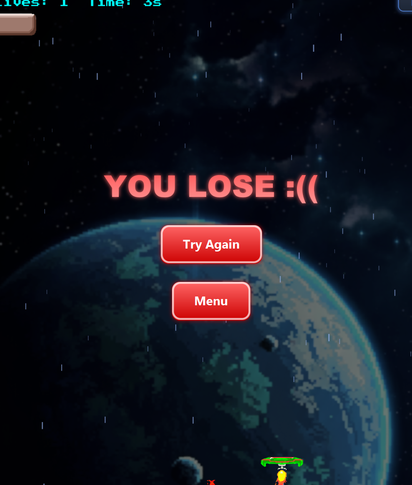
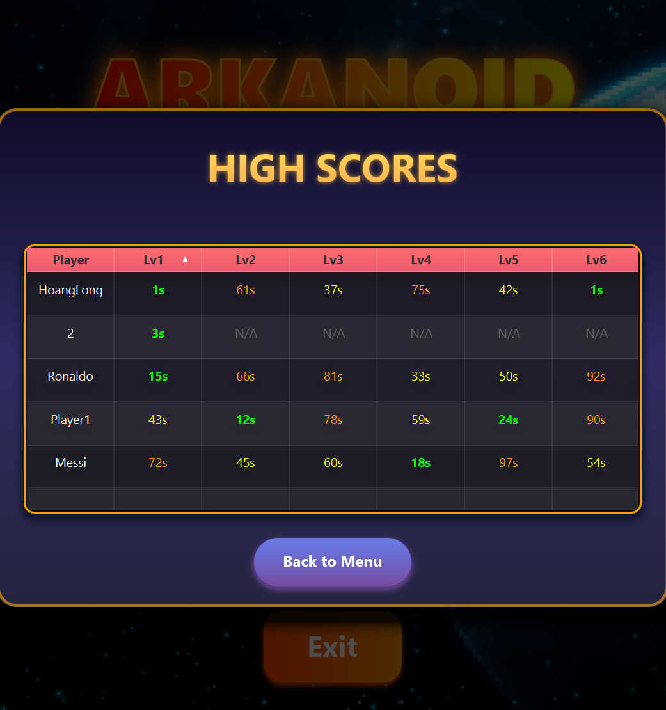
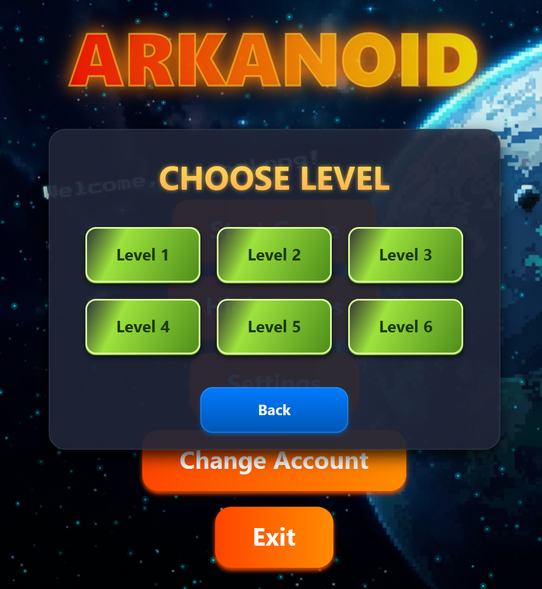
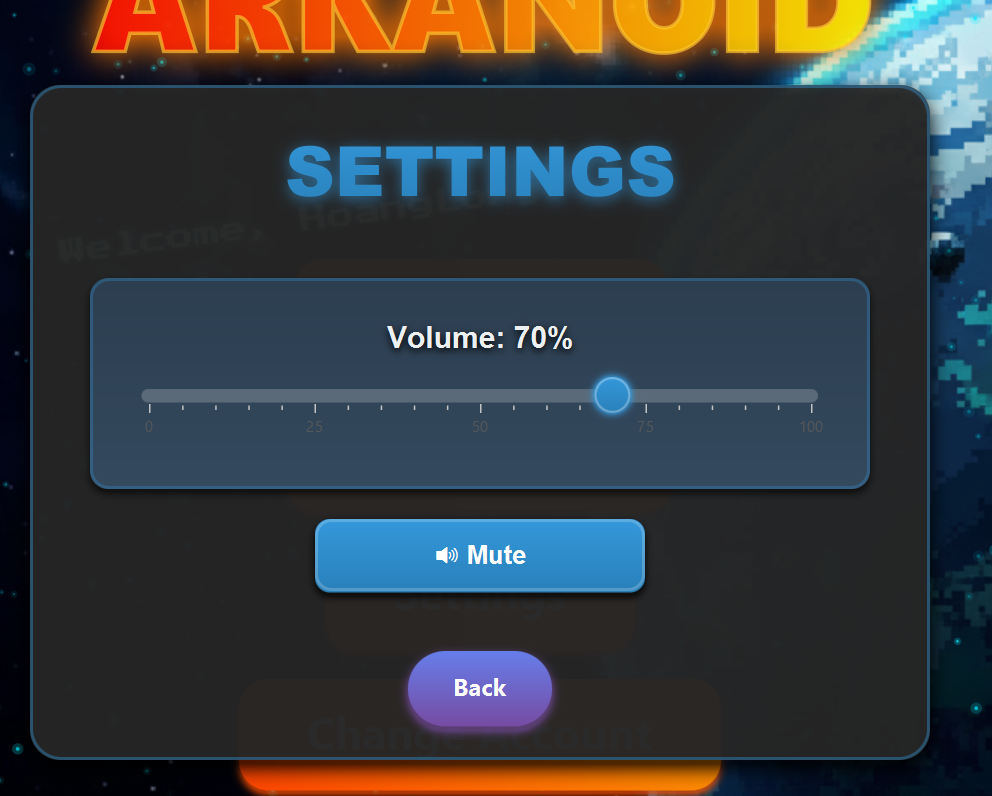

# Arkanoid Game - Object-Oriented Programming Project

## Author
Group 8 - Class INT2204 5

- Trần Hoàng Long - 24022813
- Phạm Minh Hải - 24022788  
- Lê Trọng Thi - 24020654
- Phan Văn Thái Hưng - 24022798 (class INT2204 6)

**Instructor:** [Tên giảng viên]  
**Semester:** HK1 - Năm học 25/26

---

## Description
This is a classic Arkanoid game developed in Java as a final project for Object-Oriented Programming course. The project demonstrates the implementation of OOP principles and design patterns.

**Key features:**

- Developed using Java 17+ with JavaFX/Swing for GUI.
- Implements core OOP principles: Encapsulation, Inheritance, Polymorphism, and Abstraction.
- Applies multiple design patterns: Singleton, Factory Method, and State.
- Features multithreading for smooth gameplay and responsive UI.
- Includes **animations using sprite sheets** for dynamic game objects.
- Integrates **sound effects** and background music for immersive experience.
- Modern and visually appealing **UI designed with FXML and styled with CSS**.
- Supports **save/load game functionality** and leaderboard system.

**Game mechanics:**

- Control a paddle to catch and bounce the ball to break bricks.
- Bricks have a chance to drop **power-ups**, granting special abilities.
- The game features **multiple levels** with increasing difficulty.
- Players have a limited **time and lives** for each level.
- Earn points by breaking bricks and collecting power-ups; compete for **high scores**.
- Progress through levels, each with unique layouts and challenges.

---

## UML Diagram
**Class Diagram**  

## Class Diagram

The class diagram for the project is included in the repository root folder.  
You can open the `classDiagram.puml` (or `.svg`) directly when you open the project.

---

## Design Patterns Implementation

### 1. State Pattern
- **Used in:** Game states (e.g., MenuState, PlayState, PauseState)
- **Purpose:** Manages different game states and transitions between them.
- **Advantages:** Highly extensible; each state can have its own logic (`xState`), controller (`xCtrl`), FXML (`xfxml`), and CSS (`xcss`), making it easy to add new states without modifying existing code.

### 2. Singleton Pattern
- **Used in:** SoundManager
- **Purpose:** Ensures there is only one instance of SoundManager throughout the game.
- **Advantages:** Provides centralized control of background music and sound effects, preventing conflicts and redundant instances.

### 3. Factory Pattern
- **Used in:** Power-up creation
- **Purpose:** Creates different types of power-ups (e.g., Expand Paddle, Multi Ball, Shield) dynamically.
- **Advantages:** Simplifies object creation and makes it easy to add new power-up types without changing existing code.

## Multithreading Implementation
The game uses multiple threads to improve performance and responsiveness:

- **Game Loop Thread:** Runs the main game logic at 60 FPS, ensuring smooth gameplay.
- **JSON I/O Thread:** Handles reading and writing data (e.g., level info or scores) from/to JSON files without blocking the game.
- **Audio Thread:** Plays sound effects asynchronously, so sounds do not freeze the game.
- **Rendering (JavaFX Application Thread):** Handles drawing images and animations on the screen.

---

## Installation
1. Clone the project from the repository.  
2. Open the project in your IDE (IntelliJ IDEA recommended).  
3. Run the project.  

---

## Usage

### Controls
| Key / Input         | Action            |
|---------------------|-------------------|
| ← or A              | Move paddle left  |
| → or D              | Move paddle right |
| SPACE               | Launch ball       |
| ESC                 | Pause game        |
| Mouse Click         | Select button     |

### How to Play
1. Select an account: Choose an existing account or create a new one.
2. Start the game: Click "Start Game" and select the level you want to play.
3. Begin the level: Press SPACE to launch the ball and start the game.
4. Gameplay basics:
    - **Lives** indicate the number of chances you have.
    - **Time** represents your score in the level.
5. Lose condition: The level ends if your lives reach 0.
6. Win condition: Clear all destructible bricks to complete the level.
7. Highscore: If you achieve a higher score than before, it will be saved in the highscore list.
8. Power-ups: Some bricks may drop power-ups when destroyed, giving you special abilities.

### Power-ups
| Icon | Name         | Effect                                           |
|------|--------------|-------------------------------------------------|
| P    | Triple Paddle | Paddle splits into 3 paddles for 10 seconds    |
| B    | Extra Ball    | Adds 2 extra balls, total becomes 3 balls      |
| T    | Bonus Time    | Reduces remaining time by 5 seconds            |
| ♥    | Extra Life    | Adds 1 extra life                                |

---
## Scoring System
- **Main Score:** Based on the time taken to complete a level.
    - The faster you finish, the higher your score.
    - Score is recorded in the **HighScore** list.
- **Time Reduction:** Can be decreased during gameplay if the player collects the **Bonus Time (T)** power-up.

---

## Demo

### Screenshots

- **Main Menu**  
  

- **Gameplay**  
  

- **Win Level Screen**  
  

- **Lose Level Screen**  
  

- **High Score / Leaderboard**  
  

- **Choose Level Screen**  
  

- **Change Account Screen**  
  

- **Settings Screen**  
  

**Video Demo:**  
[Watch Gameplay Demo](src/main/resources/com/example/arkanoidProject/view/images/demo/videoPlay.mp4)
---

## Future Improvements
**Planned Features:**

- **New Game Modes:**
    - PvP mode: Two players compete against each other.
    - Co-op mode: Two players on the same team to clear levels together.
    - Boss Battle mode: Face challenging boss enemies at the end of levels.

- **Enhanced Gameplay:**
    - More diverse power-ups with unique effects.
    - New maps and level designs for more variety and challenge.

- **Technical Improvements:**
    - Improve graphics and visual effects (particle effects, animations).
    - AI opponents for single-player challenges.
    - Online leaderboard integration to track high scores globally.

## Technologies Used
| Technology       | Version   | Purpose                                                                 |
|-----------------|----------|-------------------------------------------------------------------------|
| Java             | 16+ / 17+ | Core programming language for game logic                                 |
| JavaFX           | 17.0.14 / 19.0.2 | GUI framework for graphics, media, and user interface                 |
| Maven            | 3.9+      | Build tool and dependency management                                     |
| Jackson / Gson   | 2.15.0 / 2.10.1 | JSON processing for saving/loading game data                             |
| ControlsFX       | 11.2.1    | Extra UI controls for JavaFX                                             |
| FormsFX          | 11.6.0    | Form management in GUI                                                   |
| ValidatorFX      | 0.6.1     | Input validation for forms                                               |
| Ikonli           | 12.3.1    | Icon library for JavaFX                                                 |
| BootstrapFX      | 0.4.0     | CSS styling framework for JavaFX                                         |
| FXGL             | 11.17     | JavaFX Game Library for easier game development                          |
| JUnit            | 5.12.1    | Unit testing framework                                                   |

## License
This project is developed for **educational purposes only**.  

**Academic Integrity:** This code is provided as a reference. Please follow your institution's academic integrity policies.

---

## Notes
- Developed as part of the Object-Oriented Programming with Java course curriculum.  
- All code is written by group members with guidance from the instructor.  
- Some assets (images, sounds) may be used for educational purposes under fair use.  
- Demonstrates practical application of OOP concepts and design patterns.  

**Last updated:** [10/11/2025]
